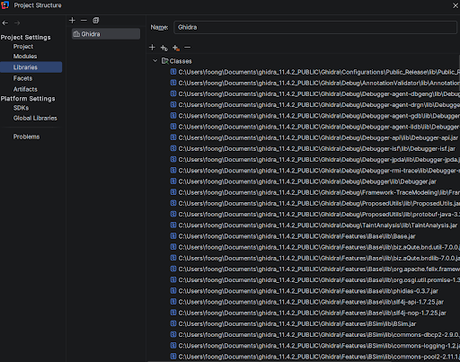
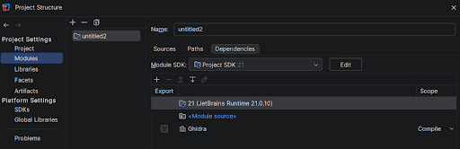
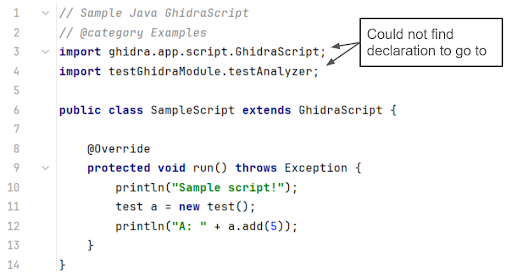
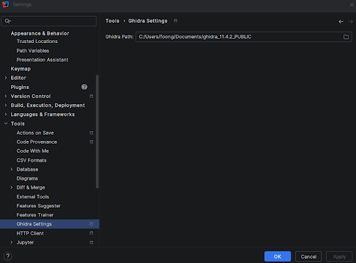
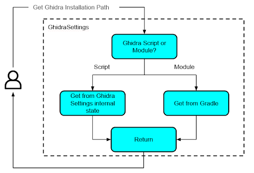
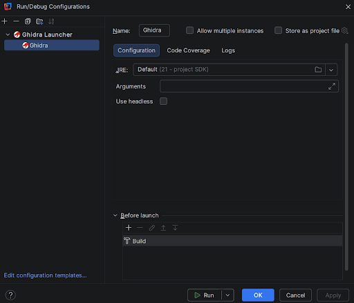
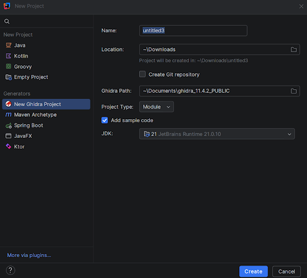

+++ 
draft = false
date = 2026-04-27T16:12:42+08:00
title = "Ghidra x IntelliJ: A Plugin Glow-Up"
description = "An article on how I improved the Ghidra IntelliJ Plugin"
authors = ["Uxinnn"]
tags = ["software development", "ghidra", "intellij"]
categories = ["software development"]
series = []
featuredImage = "images/intellij-ghidra.png"
+++


# Introduction

When I first started learning programming, the first proper IDE that I ever used was PyCharm. Since then, I became a sucker for JetBrains IDEs and have stuck to them as much as possible when developing software. As such, it was to my horror when I started exploring Ghidra scripting that full dev support was only provided for Eclipse via the GhidraDev plugin bundled together with Ghidra (Does anyone even use Eclipse…?). VSCode is also given some love via the “Create VSCode Module Project” option in Ghidra. However, IntelliJ has been left out completely. Considering that IntelliJ is the one of the most widely used IDE for Java development, I was quite surprised that the only available support for Ghidra development with IntelliJ was a [broken 3rd party plugin](https://plugins.jetbrains.com/plugin/18086-ghidra) in the IntelliJ plugin marketplace that was last updated in 2024. There was [some effort](https://github.com/R3TRO04/intellij-ghidra) by others to fix the plugin. However, it was still missing some crucial features that I wanted. Being a diehard JetBrains fan, I thus decided to fix the Ghidra IntelliJ plugin and give it a boost.

If there is too much text here and you just want to check out the plugin, here it is: https://github.com/Uxinnn/intellij-ghidra

# Evaluating the original IntelliJ Ghidra Plugin

To start, I first did a quick fix of the original IntelliJ Ghidra Plugin so that I can check out its usefulness. I then made the painful decision to install Eclipse and play with it a little to understand GhidraDev’s features and capabilities. I also checked out the VSCode skeleton project that is provided by Ghidra. Below is a comparison of features between these 3 different methods for Ghidra script/module development.

|  | Original IntelliJ Ghidra Plugin | Eclipse GhidraDev | VSCode Ghidra Module Project |
|---|---|---|---|
| Supports Ghidra Script and Module Projects? | Only scripts | Both scripts and modules | Only modules |
| Able to create new Ghidra projects from IDE? | No | Yes | No |
| Able to load existing Ghidra projects? | Sort of | Yes | No |
| Able to start Ghidra with the current Module without installation? | No | Yes | Yes |


# Features

From here, I was able to create a few requirements that I want my plugin to fulfill.

| S/N | Requirement |
|---|---|
| 1 | A user should be able to create new projects directly from IntelliJ, so that the user will not need to create skeleton directories and files manually. |
| 2 | The plugin should support both Ghidra Modules and Ghidra Scripts projects. |
| 3 | The plugin should provide functional Intellisense support (autocomplete for Ghidra APIs, import resolution from `src`), to allow for better development experience. |
| 4 | A user should be able to (as much as possible) import existing projects into IntelliJ without any modifications to the project. |
| 5 | A user should be able to launch Ghidra from IntelliJ, with the current module attached to it, so that debugging the code can be done easily. |

These requirements were distilled into the following main features:


1. **Persistent Settings Storage**
    - Stores and validates the Ghidra related settings across sessions.
2. **Gradle/IntelliJ build system Integration**
    - Provides Intellisense by configuring the build system.
3. **Run configuration**
    - Enables launching Ghidra from IntelliJ with the current module attached.
4. **New Project Wizard**
    - Allow users to create new Ghidra module/script projects directly from IntelliJ.

These components are not independent. The New Project Wizard takes in Ghidra settings from the user when a new project is created and passes these values to the persistent storage. From here, the build system and run configuration functions by querying the storage for setting values.

Building the plugin involved learning the IntelliJ Plugin SDK (which is quite introductory in its documentation), picking up Kotlin from scratch, and a fair amount of grepping through the JetBrains and Ghidra GitHub repositories until things made sense. The JetBrains forums and Claude were also helpful along the way.

Throughout this plugin development, my main consideration was on the ease of use, especially when it came to importing existing Ghidra module/script projects into IntelliJ. If it is troublesome for a user to shift to using IntelliJ, then I have no chance in attracting users away from Eclipse/VSCode.

## Gradle/IntelliJ Build System Integration

This is the core of the plugin. Previously, the plugin used a GhidraFacet to provide the features needed for Ghidra module/script development. However, this is not ideal as facets are rarely used elsewhere in IntelliJ and seem to be more of a [legacy/last-resort feature](https://platform.jetbrains.com/t/how-to-attach-a-facet-on-new-project-creation/3654/3). I thus decided to do away with facets and directly use Gradle/IntelliJ build systems to provide functional Intellisense (autocomplete, import resolution, etc.) for Ghidra module/script projects. The main hurdle here is that Modules and Scripts use different build systems: Ghidra Modules uses Gradle while Ghidra Scripts does not have any build system. Due to this difference, the 2 different project types have to be handled differently.

### Ghidra Script Projects

Since Ghidra script projects are essentially just a directory of Java files that uses the Ghidra API, we can use IntelliJ’s native build system to provide Intellisense functionality. To do so, I collated all Ghidra Jar files into a single Library, which I then attached to the root module of the project.





One issue that arose was in the case where a user wants to change the Ghidra installation that the project is using. In this case, my Ghidra Library has to be updated with the right libraries whenever a user makes a change to the Ghidra installation path via the GhidraSettings. As such, I had to add logic to perform this update in GhidraSettings.

### Ghidra Module Projects

Initially, I thought this would be the easier one to implement, as Ghidra Modules uses the Gradle build system, and IntelliJ can easily load Gradle-based projects without any extra modifications. However, it turns out that the default `build.gradle` file for Ghidra Modules is only intended for building the sources within the Module itself. Java files within the `ghidra_scripts` directory are ignored, which makes sense from Ghidra’s point of view, since the scripts are meant to be dynamically loaded by Ghidra during runtime. However, this meant that the default `build.gradle` file does not recognise `ghidra_scripts` as a source path, causing Intellisense to be dysfunctional. This means that the user will not get Ghidra API auto-complete, and classes from the module source will not be imported properly.



Faced with this issue, I looked up how Eclipse’s GhidraDev makes the magic happen. From analyzing it, I learnt that GhidraDev uses Eclipse’s internal build system to augment Gradle. As such, I tried to mimic that by using IntelliJ’s build system on top of Gradle to provide the required functionality. However, this caused tons of integration issues, not the least that IntelliJ will treat Gradle as the source of truth, and reloading Gradle in a project will cause the additions I make using IntelliJ’s build system to be wiped. As such, I had no choice but to edit `build.gradle` itself. I initially did not want to go down this route as this will require users to manually edit their `build.gradle` when importing an existing project, thereby reducing usability of my plugin. I also noticed that the default `build.gradle` hints at editing it for use in IntelliJ from the following lines:

```
// Exclude additional files from the built extension
// Ex: buildExtension.exclude '.idea/**'
```

I thus figured that this was the best way forward.

Continuing from here, I modified `build.gradle` to use the [IntelliJ IDEA Gradle plugin](https://docs.gradle.org/current/userguide/idea_plugin.html) to allow Intellisense to work properly. Using the IntelliJ IDEA Gradle plugin is ideal since it constrains my modifications to only work when using IntelliJ, and will not affect the project if it is opened in Eclipse or VSCode.

## Persistent Settings Storage

For the plugin to function, it has to be able to store Ghidra related settings persistently. Previously, this was done in the Ghidra Facet too. However, since I am doing away with the Facet, I decided to implement a project-level GhidraSettings instead to store the Ghidra related settings (This actually just consists of the Ghidra installation path). It also allows users to edit the settings and other components of my plugin to read these settings. Validation of settings was also added (E.g. To check if the given Ghidra path is valid). An added benefit was that the settings are grouped with settings from other tools, which makes it easier to find.




### Dual-Backend Design

The GhidraSetting itself has some nuance to it in order to cater to both Gradle and IntelliJ build systems. Gradle cannot read the internal state of GhidraSettings and thus, requires another way to specify the Ghidra installation path (Although GhidraSettings can read Gradle properties). To do so, I thought of GhidraSettings as having a “backend” to it. If the project is a Ghidra Module, any queries for settings are resolved by querying Gradle. If the project is a Ghidra Script, then the internal GhidraSettings state is used instead, as shown below in the figure.



By designing GhidraSettings this way, I am able to standardize the way objects can query/set Ghidra related settings (via GhidraSettings) and abstract away the logic needed to obtain these settings (via internal state or Gradle). One point to note was that I had to set the GhidraSettings configuration dialog to be read-only and mirror the settings in Gradle to make things neater.


To use Gradle for Ghidra project settings, I created a `gradle.properties` file. By specifying the `GHIDRA_INSTALL_DIR` property, I am able to use the properties file as a substitute to GhidraSettings.


## Run Configuration

Previously, run configurations were already supported to launch Ghidra from IntelliJ. However, it was unable to attach a module to Ghidra. As such, if you are developing a Ghidra module, you have to build it and install it into Ghidra to test it out, which is an EXTREMELY BIG pain. Considering that Vscode is able to attach the current project module to Ghidra during launch, I copied its logic over to IntelliJ. Turns out you just have to specify an additional JVM parameter `-Dghidra.external.modules=<MODULE_PATH>` to attach a Ghidra module to Ghidra during launch. I also modified the run configurations to obtain the Ghidra installation path from my GhidraSettings.



## New Project Wizard

This feature acts as a “frontend” for the plugin. Previously, the IntelliJ Ghidra plugin did not have a new project wizard for Ghidra projects. As such, if you want to create a new Ghidra module/script project, you have to either manually create the files and directories needed, or use Eclipse/VSCode to do it. I wanted to have functionality to create Ghidra module/script projects from IntelliJ itself, similar to what the GhidraDev Eclipse plugin has.

My Ghidra New Project Wizard provides the options shown in the figure below to the user when creating a new project.



These options are then used to create a new Ghidra module/script project. For example, Ghidra Path is passed on to GhidraSettings to store the path to Ghidra. The wizard will also construct the project skeleton.

# Conclusion

With this, I was able to develop a newly improved Ghidra IntelliJ plugin. Here is the updated feature comparison between my updated plugin and Eclipse/VSCode support.

|  | Improved IntelliJ Ghidra Plugin | Original IntelliJ Ghidra Plugin | Eclipse GhidraDev | VSCode Ghidra Module Project |
|---|---|---|---|---|
| Supports Ghidra Script and Module Projects? | Both | Only scripts | Both | Only modules |
| Able to create new Ghidra projects from IDE? | Yes | No | Yes | No |
| Able to load existing Ghidra projects? | Yes | Sort of | Yes | No |
| Able to start Ghidra with the current Module without installation? | Yes | No | Yes | Yes |

Initially, I thought that this would not take too long. However, it turns out that the devil is in the details and writing a good plugin takes some effort, especially when it comes to understanding the IntelliJ Plugin SDK (The documentation was very introductory and did not go into much depth…). It also didn’t help that I have no experience coding in Kotlin prior to this. Thankfully, I managed to get some help from the JetBrains forums and Claude. Good old grepping for keywords in the GitHub repository and staring at the code until they made sense was quite useful too.

If you are interested in giving it a try, here’s the [GitHub repository](https://github.com/Uxinnn/intellij-ghidra). I will look into how I can publish it to the IntelliJ marketplace in the near future.

# References

- New Project Wizard
    - https://plugins.jetbrains.com/docs/intellij/new-project-wizard.html
    - MavenArchetypeNewProjectWizard
    - IntelliJJavaNewProjectWizard
- Run Configuration
    - https://plugins.jetbrains.com/docs/intellij/run-configurations.html#configurationfactory
- Settings
    - https://plugins.jetbrains.com/docs/intellij/settings-tutorial.html
- Others
    - https://plugins.jetbrains.com/docs/intellij/welcome.html
    - https://plugins.jetbrains.com/docs/intellij/facet.html
    - https://github.com/JetBrains/intellij-community
    - https://github.com/JetBrains/intellij-sdk-code-samples
    - https://platform.jetbrains.com/
    - https://github.com/nationalsecurityagency/ghidra
    - https://github.com/R3TRO04/intellij-ghidra
    - https://github.com/garyttierney/intellij-ghidra
